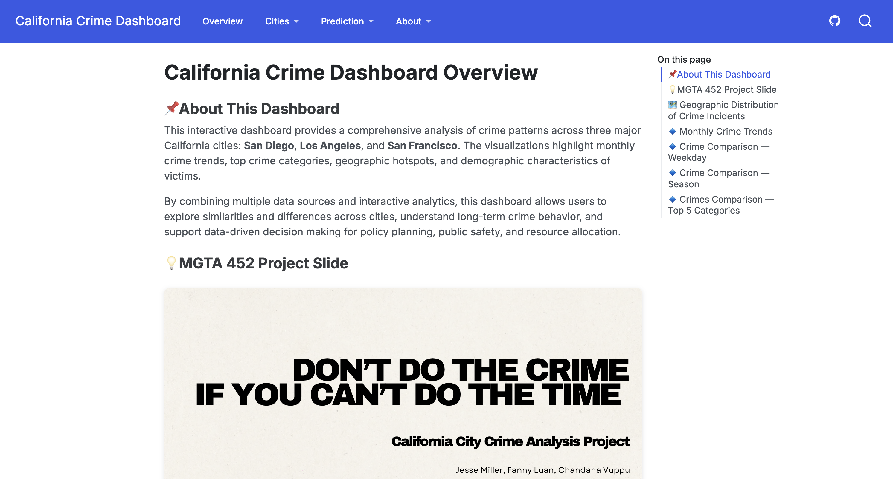

# 🚨 California Crime Dashboard

> An interactive data visualization dashboard analyzing crime patterns across San Diego, Los Angeles, and San Francisco (2021-2025)

[](https://rsm-fluan.github.io/california-crime-dashboard/)
[](https://github.com/rsm-fluan/california-crime-dashboard)


*Interactive crime analytics with geographic heat maps, temporal trends, and predictive modeling*

---

## 📊 Overview

This interactive dashboard provides comprehensive analysis of crime patterns across three major California cities. Built with **Quarto** and **Plotly**, it enables users to explore:

- 📈 **Temporal Trends** - Monthly, weekly, and seasonal crime patterns
- 🗺️ **Geographic Analysis** - Regional crime heat maps showing hot spots
- 🔝 **Crime Categories** - Top 5 most common crimes by city
- 🔮 **Predictive Analytics** - Prophet and Linear Regression forecasting models

**Live Dashboard:** [https://rsm-fluan.github.io/california-crime-dashboard/](https://rsm-fluan.github.io/california-crime-dashboard/)

---

## 🎯 Key Features

### Interactive Visualizations
- **Dynamic Dropdowns** - Switch between cities and time periods seamlessly
- **Heat Maps** - Visualize crime density across geographic regions
- **Trend Analysis** - Compare crime patterns by weekday, month, and season
- **Hover Tooltips** - Detailed information on demand

### Advanced Analytics
- **Time Series Forecasting** - Prophet model for future crime predictions
- **Statistical Modeling** - Linear regression analysis
- **Comparative Analysis** - Side-by-side city comparisons

### Clean Data Schema
- Standardized format across all three cities
- 2.3M+ crime incidents processed
- Comprehensive metadata (location, time, victim demographics)

---

## 🏙️ Cities Covered

| City | Records | Time Period |
|------|---------|-------------|
| **San Diego** | 680,263 | 2021-2025 |
| **Los Angeles** | 1,004,991 | 2021-2025 |
| **San Francisco** | 692,095 | 2021-2025 |

---

## 🛠️ Tech Stack

- **Framework:** [Quarto](https://quarto.org/) - Scientific and technical publishing
- **Visualization:** [Plotly](https://plotly.com/python/) - Interactive Python graphing
- **Data Processing:** Pandas, NumPy
- **Forecasting:** Prophet, scikit-learn
- **Deployment:** GitHub Pages

---

## 📁 Project Structure

```
california-crime-dashboard/
├── index.qmd                 # Overview page
├── sd.qmd                    # San Diego analysis
├── la.qmd                    # Los Angeles analysis
├── sf.qmd                    # San Francisco analysis
├── forecast_prophet.qmd      # Forecasting models
├── linear_regression.qmd     # Regression analysis
├── data_schema.qmd           # Data dictionary
├── assets/                   # Screenshots & assets
├── _quarto.yml               # Project configuration
└── data/                     # CSV data files

```

---

## 📊 Data Sources

Crime data sourced from official city open data portals:
- [San Diego Police Department](https://data.sandiego.gov/)
- [Los Angeles Police Department](https://data.lacity.org/)
- [San Francisco Police Department](https://data.sfgov.org/)

**Data Coverage:** 2021-2025 | **Total Records:** 2,377,349 incidents

---

## 📈 Sample Insights

- **Peak Crime Days:** Fridays show consistently higher crime rates across all cities
- **Seasonal Patterns:** Summer months (June-August) experience elevated crime levels
- **Geographic Hotspots:** Downtown areas and transit hubs show highest density
- **Top Crimes:** Vehicle theft and burglary dominate across all three cities

---

## 🎓 Academic Context

This project was developed as part of **MGTA 452 - Data Analytics** at Rady School of Management, UC San Diego.

**Objective:** Demonstrate advanced data visualization, statistical modeling, and interactive dashboard development using real-world crime data.
